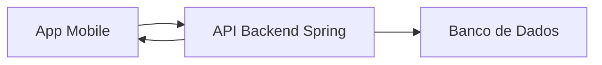

# **SEPCIIE Mobile**

## Overview:

```mermaid
graph LR;
    Mobile[App Mobile] --> API[API Backend Spring];
    API --> DB[Banco de Dados];
    API --> Mobile;
```

## Documentação:

1. [Padrões de Commits](docs/commit-patterns.md)  
2. [Gerenciamento de Branches](/docs/branch-management.md)
